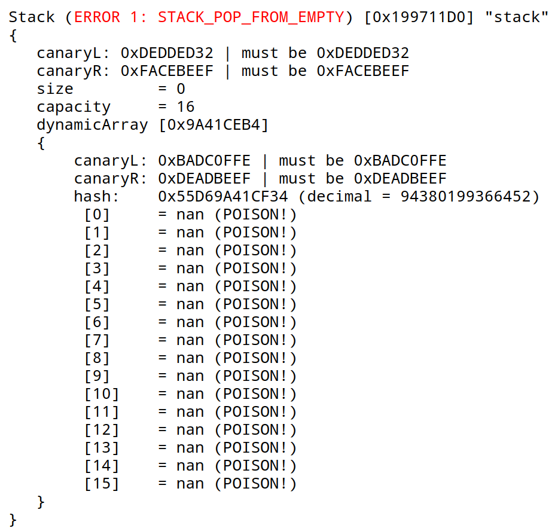

# Idea
Here you can find my implementation of stack using dynamic array. The idea behind this college assignment was to create a protected :shield: stack that would be almost unbreakable, and to start using log files.

# Levels of protection
There are three different levels of protection. Each level adds features on top of the previous one (in other words e.g. level 3 has all the features of levels 1 and 2 as well as some unique ones). To turn them on define one of the following:
```c++
#define STACK_DEBUG_LVL1
#define STACK_DEBUG_LVL2
#define STACK_DEBUG_LVL3
```
## Level 1 🪓
Only very basic techniques are used here, such as:
1. *Putting poison values in unused space*. This way if somehow in unused but allocated space the value is not poison then there has been external access to the stack's memory buffer.
2. *Assertions before and after each operation on stack*. These assertions prevent  
   * not constructed stack usage
   * usage after destruction
   * invalid size and capacity values
   * etc.  

## Level 2 :dagger:
Here canary :bird: protection is added. These are values placed before and after some buffer in order to prevent buffer overflows. In this implementation canaries are used for dynamic array's buffer as well as stack itself. Each of the four canaries has unique value.  

*P.S. You can find more information on canaries and other buffer overflow protection techniques [here](https://en.wikipedia.org/wiki/Buffer_overflow_protection#Canaries).* 

## Level 3 :crossed_swords:
Things still could go wrong even when using all the previous techniques at the same time. For example, any element in stack could be changed without the error being detected. This is why on level 3 array's buffer is hashed after each operation (we aren't aiming for performance as you can see ⏳).

# Log
Using my [log-generator](https://github.com/tralf-strues/log-generator) stack creates log files of the following format:


Code for which this log file was generated:
```c++
#include "stack.h"

int main()
{
    Stack stack = {};
    stackConstruct(&stack, 16);

    stackPop(&stack);

    stackDestruct(&stack);
}
```

